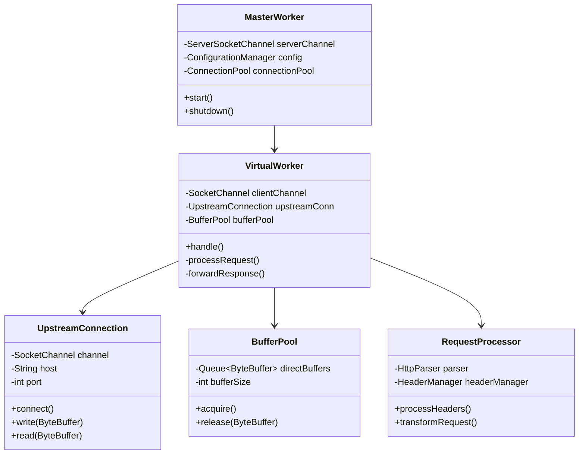

# Ameri
Simple reverse-proxy like NGINX
// TODO: Better documentation

**Basic Architecture**

```mermaid
classDiagram
    class MasterWorker {
        -ServerSocketChannel serverChannel
        -ConfigurationManager config
        -ConnectionPool connectionPool
        +start()
        +shutdown()
    }

    class VirtualWorker {
        -SocketChannel clientChannel
        -UpstreamConnection upstreamConn
        -BufferPool bufferPool
        +handle()
        -processRequest()
        -forwardResponse()
    }
    
    class UpstreamConnection {
        -SocketChannel channel
        -String host
        -int port
        +connect()
        +write(ByteBuffer)
        +read(ByteBuffer)
    }
    
    class BufferPool {
        -Queue~ByteBuffer~ directBuffers
        -int bufferSize
        +acquire()
        +release(ByteBuffer)
    }
    
    class RequestProcessor {
        -HttpParser parser
        -HeaderManager headerManager
        +processHeaders()
        +transformRequest()
    }
    
    MasterWorker --> VirtualWorker
    VirtualWorker --> UpstreamConnection
    VirtualWorker --> BufferPool
    VirtualWorker --> RequestProcessor
```
